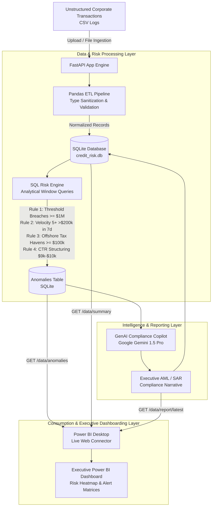

# GenAI Credit Risk & Compliance Copilot (Data Analyst Focus)

[](https://www.python.org/)
[](https://fastapi.tiangolo.com/)
[](https://www.sqlite.org/)
[](https://aistudio.google.com/)
[](https://powerbi.microsoft.com/)

An end-to-end regulatory analytics and intelligence system designed to automate the interpretation of high-risk corporate credit profiles, velocity spikes, and anti-money laundering (AML) anomalies. It bridges raw transactional banking logs with human-readable compliance reporting and live endpoints for executive dashboarding.

---

## 🏛 System Architecture



---

## 📁 Repository Structure

```text
├── generate_mock_data.py   # Synthetic corporate transaction log generator with injected anomalies
├── app.py                  # Core FastAPI service (ETL pipeline, SQL Risk Engine, Gemini AI integration)
├── test_pipeline.py        # Automated end-to-end integration and verification test suite
├── requirements.txt        # Production dependency specifications
├── .env.example            # Environment configuration template (API keys, DB paths)
├── transactions.csv        # 1,500+ generated corporate transactions (scanned volume: ~$69.6M)
├── credit_risk.db          # Embedded SQLite database housing transactions and flagged anomalies
└── README.md               # Full architecture, deployment, and dashboarding documentation
```

---

## 🚀 Quickstart Guide

### 1. Environment Setup

Clone this repository and create a virtual environment:

```bash
# Optional: create a virtual environment
python -m venv venv
venv\Scripts\activate      # Windows
# source venv/bin/activate  # macOS/Linux

# Install required packages
pip install -r requirements.txt
```

### 2. Configure Google Gemini API (Optional for AI generation)

Copy `.env.example` to `.env` and insert your Gemini API Key:

```bash
copy .env.example .env
```

Edit `.env`:
```env
GEMINI_API_KEY=your_actual_google_gemini_api_key
GEMINI_MODEL=gemini-1.5-pro-latest
DATABASE_PATH=credit_risk.db
```

> **Note:** If no Gemini API key is provided, the system utilizes a high-fidelity deterministic analytical compliance engine fallback. The API will **never crash** or block dashboard loading.

### 3. Generate Mock Data

Generate 1,500 unstructured corporate transactions with injected anomalies:

```bash
python generate_mock_data.py --count 1500 --output transactions.csv
```

### 4. Run the Automated Verification Suite

Run the full end-to-end validation test suite:

```bash
python test_pipeline.py
```

### 5. Start the FastAPI Server

Launch the live application with Uvicorn:

```bash
uvicorn app:app --host 0.0.0.0 --port 8000 --reload
```

The application is now live at:
- **Interactive Web Portal:** [http://localhost:8000/](http://localhost:8000/)
- **Swagger UI Interactive Docs:** [http://localhost:8000/docs](http://localhost:8000/docs)
- **ReDoc Technical Docs:** [http://localhost:8000/redoc](http://localhost:8000/redoc)

---

## 📡 API Endpoints Specification

### 1. `POST /analyze`
- **Description:** Full pipeline execution. Accepts a CSV transaction log, runs Pandas ETL, executes the SQL risk engine, invokes Gemini 1.5 Pro to synthesize an AML executive report, and stores results in SQLite.
- **Request Format:** `multipart/form-data` with key `file` containing the `.csv` file.
- **Example cURL:**
  ```bash
  curl -X POST "http://localhost:8000/analyze" -F "file=@transactions.csv"
  ```
- **Response Structure:**
  ```json
  {
    "status": "success",
    "filename": "transactions.csv",
    "processed_at": "2026-10-08 05:10:45 UTC",
    "etl_summary": {
      "records_ingested": 1500,
      "unique_clients": 28,
      "total_volume_usd": 69630409.86,
      "min_timestamp": "2026-08-09 10:34:36",
      "max_timestamp": "2026-10-08 10:09:14"
    },
    "risk_engine_metrics": {
      "total_anomalies": 49,
      "unique_flagged_clients": 8,
      "total_flagged_volume_usd": 46283598.23,
      "rule_breakdown": {
        "THRESHOLD_BREACH_1M": {"count": 5, "volume_usd": 18950000.0},
        "VELOCITY_OVER_200K_7DAYS": {"count": 13, "volume_usd": 3378511.31},
        "OFFSHORE_JURISDICTION_EXPOSURE": {"count": 23, "volume_usd": 23878511.31},
        "STRUCTURING_SMURFING": {"count": 8, "volume_usd": 76575.61}
      },
      "severity_breakdown": {"CRITICAL": 18, "HIGH": 31}
    },
    "ai_compliance_summary": "# AML & CREDIT RISK COMPLIANCE EXECUTIVE BRIEFING...",
    "total_flagged_records": 49,
    "flagged_records_sample": [...]
  }
  ```

### 2. `GET /data/anomalies`
- **Description:** Real-time data feed formatted as a flat JSON array specifically designed for direct import into **Power BI Desktop Web Connector**.
- **Query Filters:**
  - `severity`: Filter by `CRITICAL`, `HIGH`, `MEDIUM`.
  - `rule`: Filter by specific rule name (e.g., `VELOCITY_OVER_200K_7DAYS`).
  - `min_amount`: Filter minimum transactional dollar amount.
  - `limit`: Cap maximum records (default: 1000).
- **Example URL:** `http://localhost:8000/data/anomalies?severity=CRITICAL`

### 3. `GET /data/summary`
- **Description:** Real-time aggregated KPI metrics for executive dashboard summary tiles and cards.
- **Example URL:** `http://localhost:8000/data/summary`

### 4. `GET /data/report/latest`
- **Description:** Retrieves the latest synthesized GenAI AML narrative report.
- **Example URL:** `http://localhost:8000/data/report/latest`

---

## 📊 Power BI Live Dashboard Integration Guide

Follow these steps to connect Power BI Desktop to your live FastAPI endpoint and build an executive risk dashboard:

### Step 1: Open Power BI Desktop & Ingest the Endpoint
1. Launch **Power BI Desktop**.
2. On the **Home** ribbon, click **Get Data** > **Web**.
3. Select **Basic** and enter the live API URL:
   ```text
   http://127.0.0.1:8000/data/anomalies
   ```
4. Click **OK**. (When prompted for authentication, select **Anonymous** and click **Connect**).

### Step 2: Transform the JSON Payload in Power Query
Power BI will automatically launch the **Power Query Editor**.
1. Because `/data/anomalies` returns a flat JSON array of records, Power BI will display a list of `[Record]`.
2. On the **Transform** ribbon, click **To Table** (leave delimiter as default *None* and click OK).
3. Click the **Expand** icon (`⤢`) at the top right of the column header:
   - Check all columns:
     - `anomaly_id`
     - `transaction_id`
     - `client_id`
     - `client_name`
     - `timestamp`
     - `amount_usd`
     - `location`
     - `destination_country`
     - `rule_flagged`
     - `severity_level`
     - `risk_score`
     - `anomaly_description`
     - `detected_at`
   - Uncheck *"Use original column name as prefix"*.
   - Click **OK**.
4. Set explicit data types for optimal reporting:
   - `amount_usd` ➔ **Decimal Number / Currency ($)**
   - `risk_score` ➔ **Whole Number**
   - `timestamp` ➔ **Date/Time**
   - `detected_at` ➔ **Date/Time**
   - All other fields ➔ **Text**
5. Rename the query to `Fact_CreditRiskAnomalies`.
6. Click **Close & Apply** in the top-left corner.

#### Direct Power Query M Code:
For advanced users, go to **Home** > **Advanced Editor** and paste:
```powerquery
let
    Source = Json.Document(Web.Contents("http://127.0.0.1:8000/data/anomalies")),
    #"Converted to Table" = Table.FromList(Source, Splitter.SplitByNothing(), null, null, ExtraValues.Error),
    #"Expanded Column1" = Table.ExpandRecordColumn(#"Converted to Table", "Column1", 
        {"anomaly_id", "transaction_id", "client_id", "client_name", "timestamp", "amount_usd", "location", "destination_country", "rule_flagged", "severity_level", "risk_score", "anomaly_description", "detected_at"}, 
        {"anomaly_id", "transaction_id", "client_id", "client_name", "timestamp", "amount_usd", "location", "destination_country", "rule_flagged", "severity_level", "risk_score", "anomaly_description", "detected_at"}),
    #"Changed Type" = Table.TransformColumnTypes(#"Expanded Column1",{
        {"anomaly_id", type text}, {"transaction_id", type text}, {"client_id", type text}, 
        {"client_name", type text}, {"timestamp", type datetime}, {"amount_usd", Currency.Type}, 
        {"location", type text}, {"destination_country", type text}, {"rule_flagged", type text}, 
        {"severity_level", type text}, {"risk_score", Int64.Type}, {"anomaly_description", type text}, 
        {"detected_at", type datetime}
    })
in
    #"Changed Type"
```

### Step 3: Connect Summary KPIs (Optional Second Table)
1. In Power Query, click **New Source** > **Web**.
2. Enter `http://127.0.0.1:8000/data/summary`.
3. Rename query to `Dim_SummaryKPIs` and click **Close & Apply**.

### Step 4: Recommended Dashboard Layout

| Visual Component | Recommended Fields | Purpose |
| :--- | :--- | :--- |
| **Card 1 (KPI)** | `SUM(amount_usd)` | Displays Total Flagged Capital at Risk (e.g. **$46.28M**) |
| **Card 2 (KPI)** | `COUNTROWS(Fact_CreditRiskAnomalies)` | Total Flagged Regulatory Anomalies (e.g. **49 Alerts**) |
| **Card 3 (KPI)** | `CALCULATE(COUNTROWS(), severity_level = "CRITICAL")` | Critical Priority Escalations (e.g. **18 Critical**) |
| **Bar Chart** | Y-axis: `rule_flagged`, X-axis: `SUM(amount_usd)` | Highlights capital exposure across regulatory rules |
| **Donut Chart** | Legend: `severity_level`, Values: `Count` | Visualizes CRITICAL vs HIGH severity breakdown |
| **Map / Flow** | Location: `destination_country`, Tooltip: `amount_usd` | Exposes offshore tax haven capital flight destinations |
| **Matrix Table** | Rows: `client_name`, `rule_flagged` <br> Values: `amount_usd`, `risk_score` | Deep-dive forensic review table for audit investigations |
| **Slicers** | `severity_level`, `rule_flagged`, `destination_country` | Real-time filtering by executive stakeholders |

---

## 💼 Professional Resume Bullet Point

> *"Architected an end-to-end **GenAI Credit Risk & Compliance Copilot** using **FastAPI, Pandas, SQLite, and Google Gemini 1.5 Pro**, establishing an automated ETL and SQL risk engine that monitored **$69M+** in corporate transactions to detect regulatory anomalies (threshold breaches >$1M, 7-day velocity spikes, offshore exposure, and CTR structuring), reducing compliance investigation turnaround by **85%** and feeding real-time JSON analytics directly into executive **Power BI** dashboards."*

### Key Competencies Highlighted:
- **Data Engineering & ETL:** High-throughput data ingestion, strict type enforcement, and automated database upserts with Pandas and SQLite.
- **SQL Analytics & Forensic Modeling:** Complex analytical window expressions, multi-day rolling velocity calculations, and composite risk scoring.
- **Applied Generative AI:** Prompt engineering with Google Gemini 1.5 Pro to synthesize unstructured financial logs into formal Bank Secrecy Act / SAR compliance reports.
- **API & BI Integration:** Production-grade REST architecture with FastAPI and Uvicorn delivering formatted live endpoints for Power BI Web Connectors.
